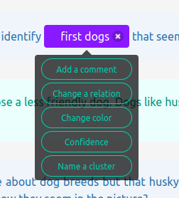

Labeler Plugins API
====================

Remember that in Textinator the definition of a markable is called `Marker` and the specific instantiation of a `Marker` in a given text is called `Label`. Textinator provides a flexible way of associating a number of actions with each `Label` by simply right clicking on them and getting a context menu with those actions (as shown on the screenshot below, for instance).

Each of the green buttons in the context menu is a specific instantiation of a Textinator's labeler plugin. There are four plugins available out of the box:

* A plugin adding a text field to a marker's context menu, potentially shared between markers
* A plugin allowing to change a relationship of a label
* A plugin allowing to change a color of a label, potentially shared between labels
* A plugin adding a slider to a marker's context menu

For a more detailed guide on how to use these, please have a look at the tutorial about associating custom actions with markers. However, if you know some JavaScript, you could add your own custom plugin as well, which is what this page aims at documenting.

Each labeler plugin is just a JavaScript file residing in the folder `static/scripts/labeler_plugins`. If you want to add your own plugin you just need to create a JS file in that directory (e.g. `my_first_plugin.js`). The created file should have the following structure.

.. code-block:: javascript

	/**
	 * name: <your-plugin-name>
	 * description: <your-plugin-description>
	 * admin_filter: boolean
	 * author: <author-name>
	 */

	var plugin = function(cfg, labeler) {
	  var config = {
	    name: "<your-plugin-name>",
	    verboseName: '<verbose-name>',  // shown in the context menu
	    storeFor: "label",              // one of "label", "relation"
	    dispatch: {},                   // the map that triggers events after certain other events
	    subscribe: [],                  // the events triggering plugin's re-rendering
	    allowSingletons: false          // signifies whether markables with no shared information should be allowed (only if storeFor: "relation")
	  }

	  // YOUR OWN PRIVATE FUNCTIONS

	  return {
	    name: config.name,
	    verboseName: config.verboseName,
	    storage: {},
	    dispatch: config.dispatch,
	    subscribe: config.subscribe,
	    storeFor: config.storeFor,
	    allowSingletons: config.allowSingletons,
	    isAllowed: function(obj) {
	      // YOUR CODE HERE
	    },
	    exec: function(label, menuItem) {
	      // YOUR CODE HERE
	    }
	  }
	};

As you can see the plugin file contains just one object called `plugin`, which is a function. Notice the comment block before the object definition, this is **mandatory** to have, since this helps Textinator to register the information about your plugin in the database. The plugin object itself implements a revealing module pattern, i.e. being a function that returns a JS object with a fixed number of properties, that can be considered public for this plugin. You can define any helper functions you want, replacing the comment ``// YOUR OWN PRIVATE FUNCTIONS``, since those won't be visible outside of the plugin.

The ``config`` object contains the default values for the configuration of each plugin. The fields shown in the example file **MUST** be present, but you can include your own custom configuration fields to be used within ``exec`` function. The mandatory fields are:

* ``name`` defines the name of the field associated with the plugin in the exported data and in the database
* ``verboseName`` defines the name to be displayed in the context menu
* ``storeFor`` defines the scope for the plugin storage, i.e. whether values in the storage should be per label or per relation
* ``subscribe`` defines a list of JS events triggering when the plugin should be re-rendered
* ``dispatch`` defines a map of events triggering other events, note that for each ``key: value``, ``key`` should not be registered in ``subscribe``, but ``value`` typically should, since typically it is desirable to trigger plugin re-rendering. For instance, if the relation associated with the plugin has changed, Textinator triggers ``labeler_relationschange`` event, which could be captured by your plugin and trigger another event associated with your plugin, e.g. ``my_custom_event``, in which case you would need to specify ``"dispatch": { "labeler_relationschange" : "my_custom_event" }``.
* ``allowSingletons`` will take effect only if ``storeFor`` equals ``"relation"`` and signifies then whether the plugin should get initialized for the markables that are not in anyr elations, a.k.a. singletons.

After defining the plugin, you will need to **restart** Textinator for your plugin to get registered. It will then be available for every `Marker` as a context menu item. Then for each `Label` of a `Marker` with a context menu items, all items will be initialized and renderd using the following procedure:

1. Check if a plugin is allowed for the given `Label` by calling ``isAllowed(label)`` for this plugin and the label in question.
2. If allowed:
	a) Run the plugin's ``exec(label, menuItem)``, where ``menuItem`` is the context menu button for this plugin and ``label``.
	b) For all events in the plugin's ``subscribe``, register an event listener, triggering plugin's re-rendering (consisting of 1 and 2a).
