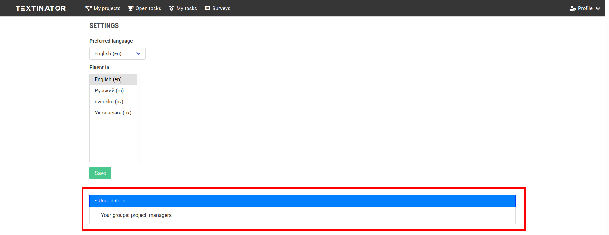
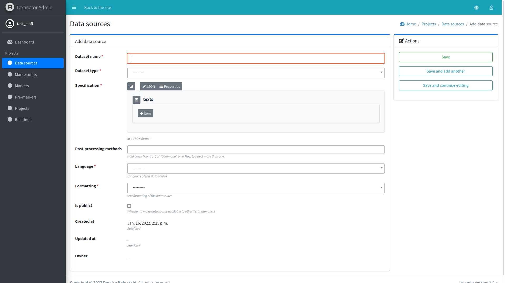

[Part 2] Adding a new data source
====================================

.. contents:: Table of Contents
	:local:

Data sources can only be added by staff members (check for the small cog near your user icon in the top right corner) that
have been assigned to the `project_managers` user group. You can check if you have been assigned to that user group by
clicking on `Profile` -> `Settings`, which should show the page, similar to the one on the screenshot below.

Check that the `User details` pane (marked by the right rectangle in the screenshot above) has `project_managers` in the list
of your user groups. If it doesn't, please contact your system administrator to be added to that group.

After you have been added to the `project_managers` group, you can access the data source creation form in multiple ways:

via `Quick links` pane on the `Welcome` page.
	.. image:: images/add_data_source1.png
	  :width: 100%
	  :alt: The screenshot of the first method
via `Admin panel dashboard`
	.. image:: images/add_data_source2.png
	  :width: 100%
	  :alt: The screenshot of the second method
via `Admin panel/Data sources`
	.. image:: images/add_data_source3.png
	  :width: 100%
	  :alt: The screenshot of the third method

All of these methods will lead to exactly the same form, shown below.

The following fields are **mandatory** for creating a data source:

- *name* - the name of your dataset (max. 50 characters). Although there are no strict requirement on uniqueness,
  make sure your name is unique enough, so that you can find your dataset when creating the project.
- *type* - currently Textinator supports 4 types of data sources:

  - plain text -- input text directly in the admin interface (mostly for testing)
  - plain-text files -- a bunch of files hosted on the same server as Textinator
  - JSON files -- a bunch of JSON files hosted on the same server as Textinator
  - Texts API -- a REST API that will be used for getting each datapoint (the endpoint should be specified)

- *specification* - a JSON-specification, dependent on type:

  - for *plain text* type you just enter a number of textual snippets to be used as data for annotation;
  - for *plain-text files* you need to specify files and/or folders containing your files
    (see below on where these files/folders should be located);
  - for *JSON files* you need to specify files and/or folders similar to *plain-text files*, but also a key
    in the JSON object that will contain the text;
  - for *Texts API* you need to specify only the endpoint to the server compatible with Texts API (see below).

- *language* - the language of the data
- *formatting* - formatting of the data, can be either plain text or formatted text (e.g., with tabs) or markdown.

*Optional* fields include:

- *post-processing methods* - any Python methods defined by your system administrator that can be used for cleaning
  the data (e.g., remove Wikipedia's infoboxes). Note that currently Textinator does NOT provide any such methods
  by default, so talk to your system administrator if you need any such methods.
- *is public?* - by default all data sources are private and can be accessed via UI only by the person who created
  the data source. If you want to make it accessible to all Textinator users, tick this option. Note, that all people
  with access to your server **will** be able to access the underlying data (unless you use Texts API).

Which data source type should I choose?
-----------------------------------------
If you want to do quick and dirty annotation test, say, to check how well the annotators understand the instructions,
you should use a `plain text` type and just copy-paste a couple of texts there. Recall that if your texts are pre-formatted
(e.g., with tabs) or contain markdown, you should specify the formatting type accordingly.

In all other circumstances we **recommend** using *Texts API* for multiple reasons:

1. *Limiting access to your data*. If you use either *Plain-text files* or *JSON files*, they should be located on the very
   same server as Textinator. So at the very least your system administrator will have access to your data. A good way to
   avoid it is to setup your own server, compatible with Texts API (read below), so that you can have full control over
   who has access to the data.
2. *Decoupling*. Textinator is an annotation platform, not a data management platform.
3. *Flexibility*. Data comes in all possible shapes and forms and it would be a very hard task to support various data sources.
   For instance, some researchers might have data in MySQL or SQLite, others in MongoDB and others in ElasticSearch. Supporting
   all of these inputs, some of which may change their APIs in future, is a mammoth task. Instead, people can implement their own
   small REST APIs and just provide the endpoint to Textinator - much more flexible!
4. *Privacy considerations*. If you want to annotate e-mails or SMS, then authors of the data might request deletion of their
   data quoting laws such as GDPR in the European Union. Neither deleting only parts of the datasets nor anonymizing the data
   is possible via Textinator.
5. *Disk space limitation*. Textual datasets can get quite large (think Wikipedia), which will induce unnecessary overhead 
   on the machine running Textinator - we want to avoid that. Furthermore, as time passes, even smaller datasets in large
   amounts may end up requiring unreasonable large amounts of space. At that point, one would need to set some kind of 
   expiration policy as to when data should be auto-removed along with reminders to the data owners... So I will just reiterate
   Textinator is an annotation platform :)

The remaining two types of data sources (*plain-text files* and *JSON files*) are left for backward compatibility with
pre-release versions of Textinator. They allow you to upload your data directly to the server via the secure tool of your choice
(e.g., *scp* or *rsync*) to the data folder (`Textinator/data` by default). Then you can specify the paths to the files/folders 
relative to this data folder, given that they are either plain-text or JSON files.

What server is compatible with Texts API?
-----------------------------------------
.. note::
   Requires programming skills.

Texts API is pretty simple and requires your server to support 4 GET requests:

/get_datapoint -- takes 'key' as a GET argument and returns the following JSON object 
	.. code-block:: json

	    {
	        "text": "text-for-the-given-key"
	    }
/get_random_datapoint -- returns the following JSON object 
	.. code-block:: json

	    {
        	"key": "key-for-the-random-datapoint",
        	"text": "text-for-the-key-above"
	    }
/size -- returns the following JSON object
	.. code-block:: json

	    {
        	"size": "size-of-your-dataset"
	    }
/get_source_name -- takes 'key' as a GET argument and returns the name of the source for the datapoint (e.g., a file name)
	.. code-block:: json

	    {
	        "name": "source-name-for-the-datapoint-under-the-given-key"
	    }

A simple example Flask server is provided in the `example_texts_api folder in the GitHub repository <https://github.com/dkalpakchi/Textinator/tree/master/example_texts_api>`_.

What if I really want to upload data via UI?
---------------------------------------------
.. warning::
   This feature is subject to change or removal in future.

Currently there is no *recommended* way of uploading your files into Textinator. However, if you really insist, there is a temporary
workaround that has multiple limitations (introduced to discourage its usage):

1. Your data will be accessible by **all** other staff members of Textinator. So this solution should only be used either if you are the only user of Textinator or there is an honor code in place.
2. The upload size is limited to 20MB per file.
3. You are still limited to either plain-text files or JSON files (that can contain plain text, preformatted text or markdown though).

In order to use this workaround, you need to ask your system administrator to add you to the `file_managers` user group.
Then you will see "FileBrowser" in the menu of the admin UI and will be able to access Textinator's file browser. You will then
need to create a folder with the same name as your username and upload your files in that folder. If you place your files in
any other folder, they will **NOT** be seen by Textinator.

