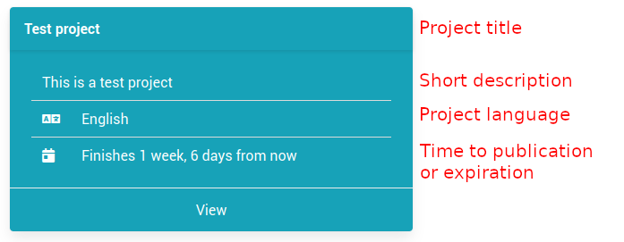

[Part 3] Creating your first project
=====================================

After having created a data source, we can actually go ahead and create our first Textinator project. Similar to adding a new data source, there are 3 ways of accessing the project creation form.

via `Quick links` pane on the `Welcome` page.
	.. image:: images/add_project1.png
	  :width: 100%
	  :alt: The screenshot of the first method
via `Admin panel dashboard`
	.. image:: images/add_project2.png
	  :width: 100%
	  :alt: The screenshot of the second method
via `Admin panel/Projects`
	.. image:: images/add_project3.png
	  :width: 100%
	  :alt: The screenshot of the third method

All of these methods will lead to exactly the same form, shown below.

The following fields are **mandatory** for creating a project:

*Generic tab*
	- *title* - the title of your project (max. 50 characters);
	- *language* - the language of your project, needs to match the language of the data sources (is used to filter out only annotators who have indicated to be fluent in that language);
	- *short description* - a short and concise description of your project (to be shown in the Project card);
	- *publishing date* - date of publishing (important for projects, open to public, which is true by default);
	- *expiration date* - last date when the annotations can still be performed.

*Task specification tab*
	- *type of the annotation task* - one of the :ref:`8 annotation tasks supported out of the box<standard tasks>` or *Generic* for your custom annotation tasks.

*Data tab*
	- *data sources* - the data to be annotated, needs to match the langauge of the project.

The following fields are *optional* and most of them are self-explanatory. We will highlight only those that relate to the mandatory fields.

*Task specification tab*
	- *guidelines* - the rich-text input for annotation guidelines, where you could give an elaborate description with examples (these guidelines will be accessible by annotators at all times as a modal window);
	- *reminders* - the summary of essential points of the guidelines, visible at all times and cannot be hidden.

*Settings tab*
	- *should the project be public?* - a switch of whether the project should be open to public (then publishing date plays a vital role). If the switch is off, the users will not see the project
	- *should selecting the labels be allowed?* - whether annotated spans of text should be clickable (**essential** that it is turned on if you have any relations, since this is how relations are annotated in the current version of Textinator)

After you have created the project it should appear under *My projects* tab in Textinator and have a card that has the following anatomy.

If you have added a summary video, it will appear between the project title and short description.