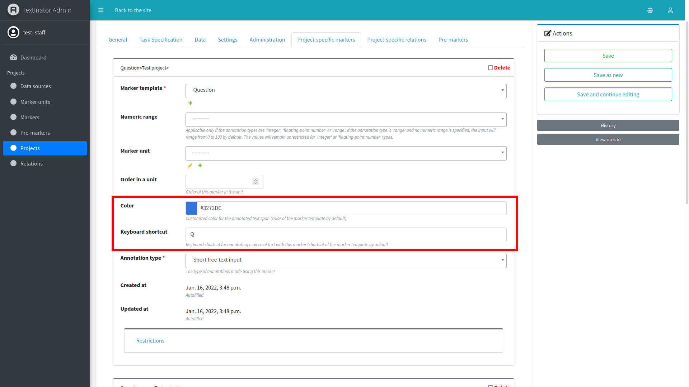
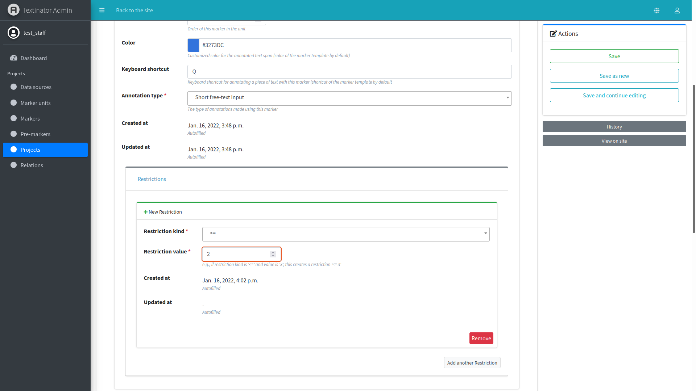
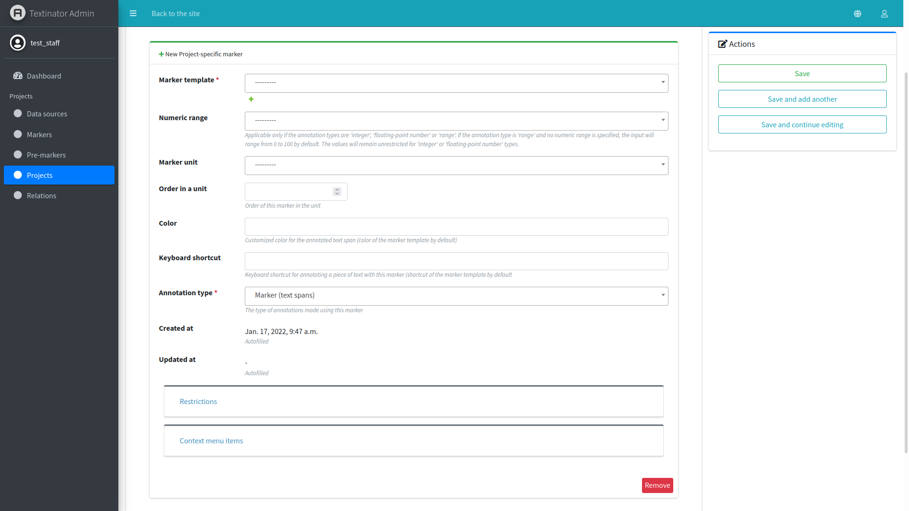
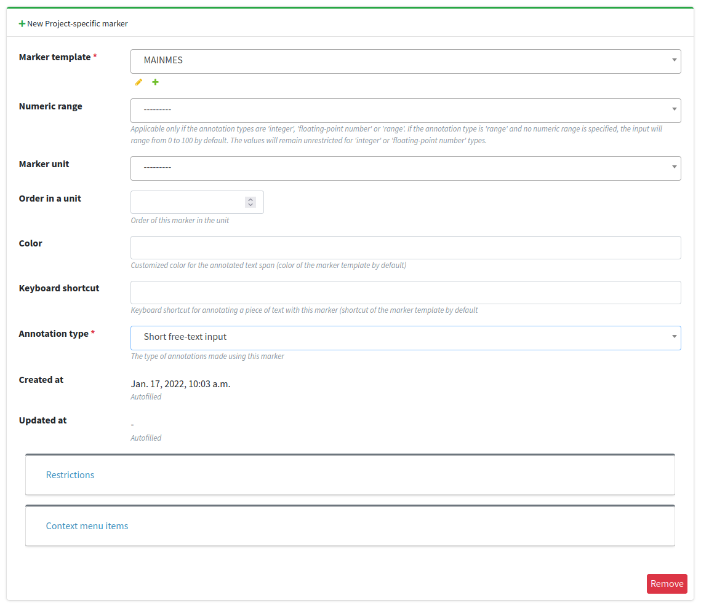
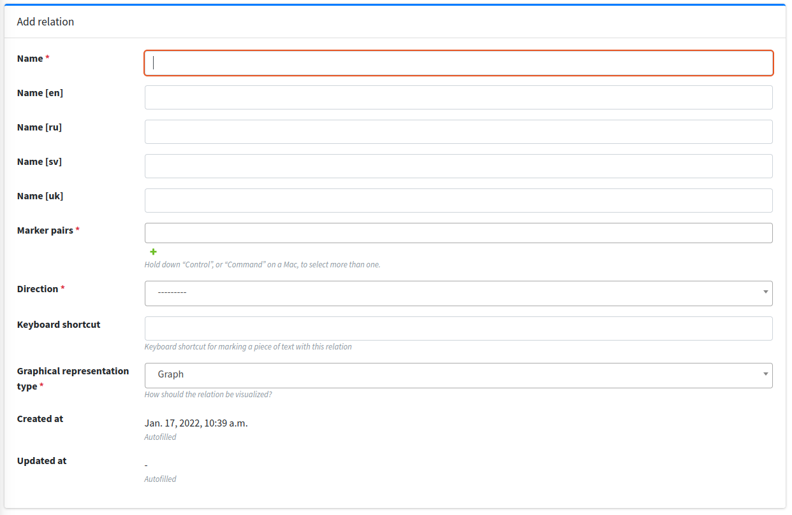
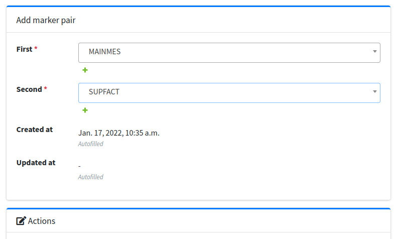
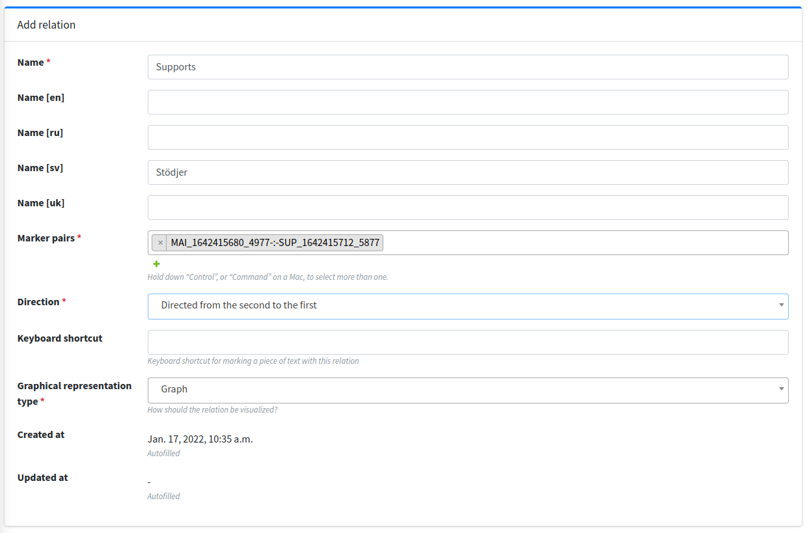
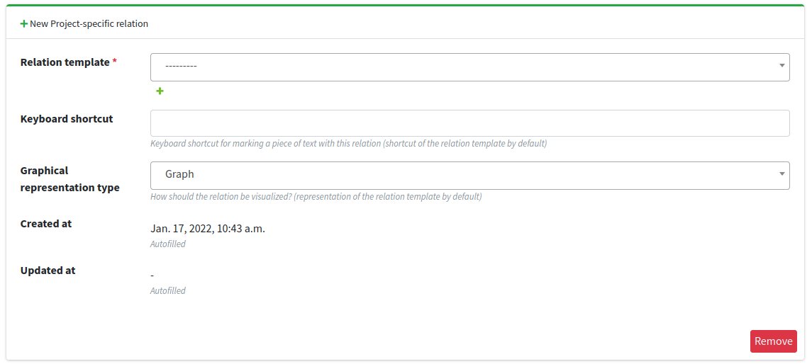

.. _custom_annotation_task:

[Part 5] Creating a custom annotation task
===========================================

.. contents:: Table of Contents
  :local:

Minor modifications to out-of-the-box task types
-------------------------------------------------

You can the following modifications to the out-of-the-box tasks without any ramifications to the data export:

- color of markers
- hotkeys for markers or relations
- changing visualization type for a relation (graph or list)
- adding custom restrictions on the number of markers (e.g., there should be at least 2 distractors per each submitted multiple choice question)

The changes of color and hotkeys for the markers can be done via the project's form `Project-specific markers` tab (relevant fields are marked by a red rectangle in the screenshot below).

The changes of hotkeys and visualization type for the relations can be done via the project's form `Project-specific relations` tab (relevant fields are marked by a red rectangle in the screenshot below).

.. image:: images/existing_rel_mod.png
  :width: 100%
  :alt: The screenshot of the form for customizing a relation

Custom restrictions for the markers can be added via the `Restrictions` pane available at the bottom of each `Marker's` form. For instance, the restriction of having at least 2 markers of such kind can be added as shown in the screenshot below.

Major modifications to out-of-the-box task types
-------------------------------------------------

Adding custom markers or relations to the out-of-the-box tasks is also possible, but current export functionality is configured to work only with the default markers/relations to give as consice JSON file as possible. Having said that, you could try to add markers/relations to your task and see if the default export functionality still works. If it doesn't, you can use the generic export by clicking on the `Export JSON (generic)` button under `Data explorer`, which is guaranteed to contain all annotations, albeit in a somewhat longer format.

Defining custom markers
------------------------

If you want to annotate a task currently unsupported by Textinator or make a major modification to an already existing task, you will have to define custom units of annotation. Textinator supports such customized definitions through `Markers` via `Admin panel/Markers`. You need just a couple of things to define a basic *Marker*:

* defining a marker name to be used when exporting data (mandatory);
* choose a color (mandatory);
* defining the translation of the marker name to the language (among supported by Textinator) that you are going to use for annotation (optional, but highly recommended);
* choose a shortcut for the marker *(optional)*.

Let's say we want the annotators to find and mark the main message of the text in Swedish, then filled-in *Marker* fields (corresponding to the properties listed above), would look like in the picture below.

.. image:: images/marker_example.png
  :width: 100%
  :alt: The screenshot of the form for defining a marker

Now that we have defined a *Marker*, this definition will be accessible to all Textinator staff members. Now we need to add a marker following this definition to our project. In order to do that you should find the project of interest via `Admin panel/Projects`. Open the project and choose the tab called `Project-specific markers` and then click `Add another Project-Specific Marker`. You should get a form similar to the one shown below

Choose a *Marker* that you have defined before and define variant-specific properties:

1. You need to specify the type of annotations that should be made with this marker in the project. For instance, in some cases, you want to mark the correct answer in the text, in which case you should select `Marker (text spans)` as your annotation type. If you do not want the correct answers to be in the text, you might want to give annotators the freedom of providing them as a text input, in which case select `Short free-text input`. If you want to perform text classification, you will need to select `Marker (whole text)`. The other marker types are self-explanatory.

2. If you want your marker to be annotated as a part of the unit, you will need to specify a marker unit. For instance, when creating multiple choice questions, consisting of a question, a correct answer and 3 distractors, then all of them would be considered a unit. In which case you will need to create a unit first (by clicking on the green "+" button below the `Marker unit` field) and then choosing one and same unit for all 3 markers (question, correct answer and distractor).

3. If a marker belongs to a unit, you can also specify order of a marker in the unit by using `Order in a unit` field. For instance, if you want markers to appear in the order question - correct answer - distractor, then the `Order in a unit` field of the `Question` marker should have the value of 1, of the `Correct answer` marker - the value of 2 and of the `Distractor` marker - the value of 3.

4. If you require a specific number of annotations to be made by a marker prior to the submission, you could defined that using the `Restrictions` pane. For instance, if you need your annotators to enter at least two distractors, you need to add a `Restriction` of the kind `>=` and the value of 2. **Note** that you can add a restriction only **after** you have saved your marker variant for the first time.

5. If you wanted to define custom actions, available when right-clicking the marker, you could define them using `Context menu items` pane. **Note** that you can add a context menu item only **after** you have saved your marker variant for the first time. Also note that only actions previously defined by the system administrator can be used for context menu items.

In our example case, we want annotators to be able to enter main message as a free text and this is the only marker connected to it, so no units are required. We also do not need any restrictions or context menu items. Hence, the filled in form would look as below.

Defining custom relations
--------------------------

If you have more than one marker, then you might want to define custom relations between the markers. Textinator supports such customized definitions through `Relations`. You need just a couple of things to define a basic *Relation*:

* defining a relation name to be used when exporting data (mandatory);
* choose marker pairs, for which the relation is applicable (mandatory);
* choose the directionality of the relation (mandatory);
* choose graphical representation type, i.e., graph or list (mandatory);
* defining the translation of the relation name to the language (among supported by Textinator) that you are going to use for annotation (optional, but highly recommended);
* choose a shortcut for the relation *(optional)*.

Let's say we want the annotators to specify a supporting fact for each main message they find. Then we need to define another marker called `Supporting fact` (using the same procedure as before). Then we can define a relation `Supports` between the `Supporting fact` and `Main message` via `Admin panel/Relations` using the form below.

First you will need to define a marker pair of `Main message` and `Supporting fact`, which you can do by clicking on the green plus icon below the `Marker pairs` text field. This will bring the pop-up window, which would look as follows when filled in.

Afterwards, you should click on `Save` in the pop-up under `Actions` and the popup should close adding this pair to the `Marker pairs` field of the original relation. The completely filled-in form for the relation should look as shown below.

Now that we have defined a *Relation*, this definition will be accessible to all Textinator staff members. Now we need to add a relation following this definition to our project. In order to do that you should find the project of interest via `Admin panel/Projects`. Open the project and choose the tab called `Project-specific relations` and then click `Add another Project-Specific Relation`. You should get a form similar to the one shown below.

In this form you simply need to choose a newly created relation as a relation template - that's the only mandatory field. You could also customize the representation type or a hotkey, although you would typically want to do that if you are re-using someone else's relation.
