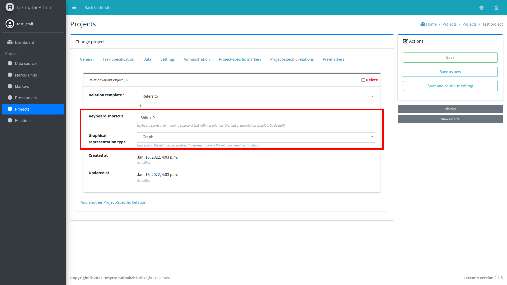

.. _custom_annotation_task:

[Part 5] Creating a custom annotation task
===========================================

.. contents:: Table of Contents
  :local:

Minor modifications to out-of-the-box task types
-------------------------------------------------

You can the following modifications to the out-of-the-box tasks without any ramifications to the data export:

- color of markers
- hotkeys for markers or relations
- changing visualization type for a relation (graph or list)
- adding custom restrictions on the number of markers (e.g., there should be at least 2 distractors per each submitted multiple choice question)

The changes of color and hotkeys for the markers can be done via the project's form `Project-specific markers` tab (relevant fields are marked by a red rectangle in the screenshot below).

The changes of hotkeys and visualization type for the relations can be done via the project's form `Project-specific relations` tab (relevant fields are marked by a red rectangle in the screenshot below).

Custom restrictions for the markers can be added via the `Restrictions` pane available at the bottom of each `Marker's` form. For instance, the restriction of having at least 2 markers of such kind can be added as shown in the screenshot below.

Major modifications to out-of-the-box task types
-------------------------------------------------

Defining markers
-------------------

If you want to annotate a task currently unsupported by Textinator or simply customize an already existing task, you will have to define custom units of annotation. Textinator supports such customized definitions through `Markers`. You need just a couple of things to define a basic *Marker*:

* find a descriptive name that will be displayed for the annotators;
* choose a color;
* choose a shortcut for the marker *(optional)*;
* choose a short nickname for the marker *(even more optional)*.

Let's say we want the annotators to find and mark the main message of the text, then filled-in *Marker* fields (corresponding to the properties listed above), would look like in the picture below.

.. image:: images/marker_example.png
  :width: 100%
  :alt: The screenshot of the form for defining a marker

Recall that *Marker* provides only annotation **definition**. For each particular project, we should create a separate variant. In order to do that you either have to create a new project (see HERE) or use an already existing one. Open a project of your choice in an admin interface and choose the tab called "Project-specific markers" (should look like in the picture below, if you have just created a new project).

.. image:: images/proj_markers_tab1.png
  :width: 100%
  :alt: The screenshot of the "Project-specifc markers" tab

Click on "Add another Project-Specific Marker".

.. image:: images/proj_markers_tab2.png
  :width: 100%
  :alt: The screenshot of the "Project-specifc markers" tab after clicking "Add project-specific marker"

Choose a *Marker* that you have defined before and define variant-specific properties:

1. If you want your annotators to be able to input text freely for the concept, select the checkbox "Is free text". If you require annotators to mark spans in the text, then do **NOT** select that checkbox (if you want them to mostly mark spans in the text and sometimes input text freely, e.g., enter paraphrases of the marked span, see [HERE]).
2. If you want your marker to be a part of the unit, i.e. group of markers. For instance, when creating multiple choice questions, consisting of a question, a correct answer and 3 distractors, then all of them would be considered a unit. In which case you will need to create a unit first (by clicking on the green "+" button near the unit) and then choose one and same unit for all 3 markers (question, correct answer and distractor).
3. If a marker belongs to a unit, then you need to define the display order for each marker in a unit. For instance, if you want question, correct answer and distractors to be shown in this order, you would need to select "Order in unit" to be 1, 2 and 3, respectively.

In our example case, we want annotators to be able to enter main message as a free text and this is the only marker connected to it, so no units are required. Hence, the filled in form would look as below.

