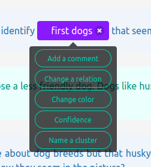
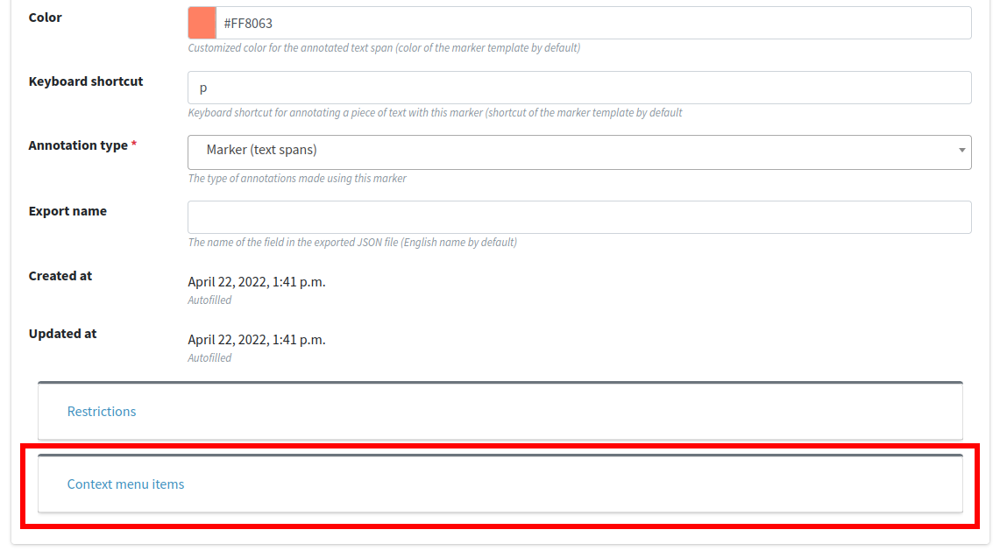
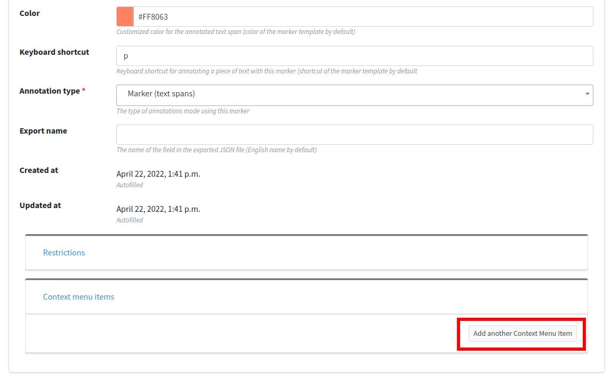
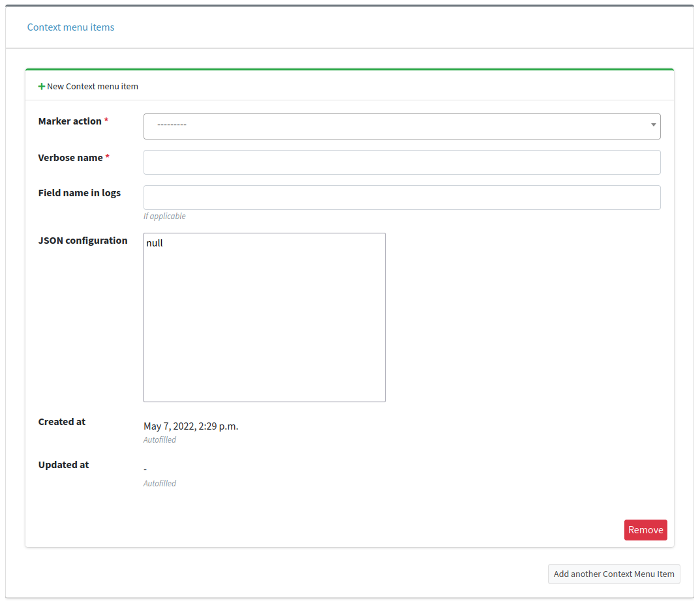

[Part 6] Associating actions with your markers
==================================================

Remember that in Textinator the definition of a markable is called `Marker` and the specific instantiation of a `Marker` in a given text is called `Label`. Textinator provides a flexible way of associating a number of actions with each `Label` by simply right clicking on them and getting a context menu with those actions (as shown on the screenshot below, for instance).

Each of the green buttons in the context menu is an action, associated with the given `Label` (as defined for the given `Marker`). Each action is an instantiation of one of the so called labeler plugins (read more about them in the developer documentation). Currently, there are four such plugins available out of the box:

* A plugin adding a text field to a marker's context menu, potentially shared between markers
* A plugin allowing to change a relationship of a label
* A plugin allowing to change a color of a label, potentially shared between labels
* A plugin adding a slider to a marker's context menu

To add an action to any `Marker`, you need to navigate to the project page in the admin interface and open the `Project-specific markers` tab. There you need to find the marker you want to add your actions to and find the `Context menu items` subpane, as shown in the screenshot below.

Click on it to open the subpane and then click on `Add another Context menu item` button (as highlighted in red in the screenshot below).

This should result in the form for adding a new context menu item.

The form has the following fields to be filled in:

- *marker action* - one of the four aforementioned plugins;
- *verbose name* - the name of the context menu items, as will appear on one of the green context menu item buttons;
- *field name in logs* - the name of the fields in the ``extra`` dictionary when exported (by default the name of the marker action itself);
- *JSON configuration* - the configuration for the plugin (as defined in the documentation page for each plugin);
