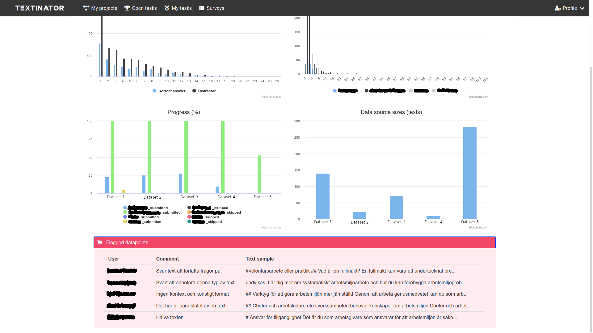

[Part 4] Exploring a data explorer
====================================

.. contents:: Table of Contents
	:local:

The role of data explorer is to provide you with administration capabilities, as well as give a birds-eye view of the annotated data.

.. note::
   The data overview functionality is expected to broaden in Textinator v1.1

Annotation statistics & progress tracking
------------------------------------------

Textinator provides a birds-eye view of the annotated data and the annotation process. Speficially, it shows the distribution of lengths for each marker that is present in the project (the top left graph in the screenshot below). 

For administrative purposes, you can also track the timing per annotation for each annotator (top right graph), their annotation progress and how many texts they chose to skip (bottom left graph), as well the overall sizes of the data sources, as a reminder (bottom right graph). Note that the screenshot is taken from the real-world annotation project, so the names of the data sources and annotators are edited out for privacy reasons. On top of that if annotators flag any texts as problematic, you can also see their comments in the data explorer under the red pane called "Flagged texts" (see example in the screenshot below).

Exporting annotations
------------------------

Textinator exports data in a custom concise JSON format specifically designed for each annotation task, supported out of the box. You will get data exported in this format if you click on the green "Export to JSON" button (see screenshots in the previous section).

If you have done any customization to an out-of-the-box task, we recommend using a generic export functionality, featuring a generic export format (thus less concise), but including all of your annotation. You can use generic export by clicking the green "Export to JSON (generic)" button.

PDF time report
------------------------