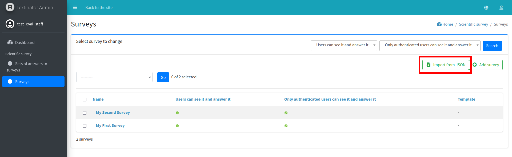
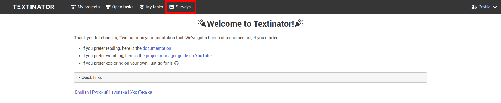
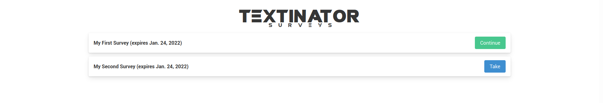
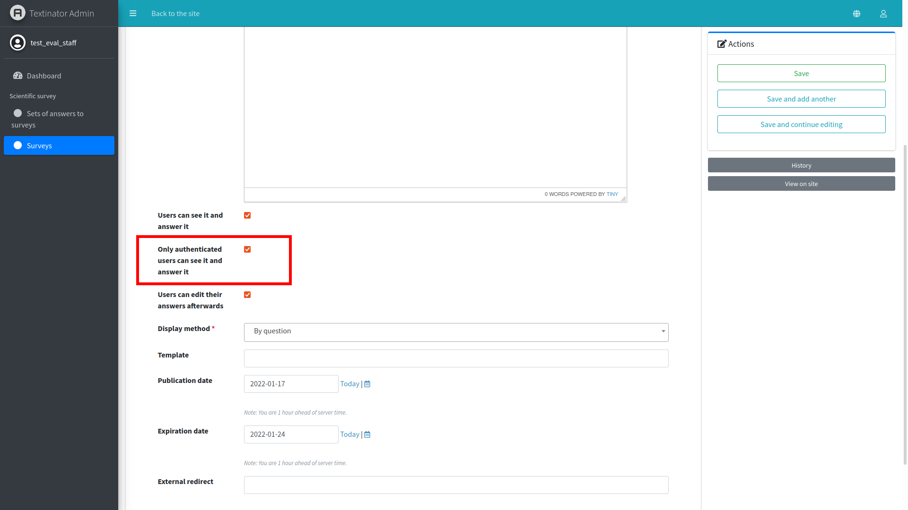
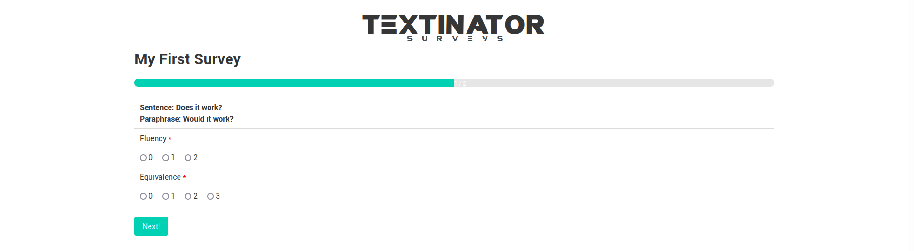

[Part 6] Setting up human evaluation
====================================

Textinator also provides rich capabilities for conducting human evaluation about the textual data in the form of surveys. In order to be able to work with surveys, you need to be a staff member and be added to the `evaluation_managers` group (you can check that similar to the how you checked the `project_managers` group earlier in the tutorial).

You could add a *Survey* in a similar fashion to either a *Dataset* or a *Project*, as we did before (via *Admin panel/Surveys/Add survey*). However, while the fields of the `Survey` creation form are self-explanatory, it can be tedious to add, say 50 survey items manually, which is why Textinator offers an import function! You can access an import function via *Admin panel/Surveys* as shown in the screenshot below.

An example of the required JSON format is given below (and more examples are available `here <https://github.com/dkalpakchi/django-scientific-survey/tree/master/example_surveys>`_).

.. code-block:: json

    {
      "name": "name-of-your-survey",
      "categories": [
        "first-category",
        "second-category"
      ],
      "items": [
        {
          "question": "Sentence: Does it work? Paraphrase: Would it work?",
          "required": true,
          "category": 1,
          "extra": {
            "model": "A"
          },
          "order": -1,
          "answer_sets": [
            {
              "type": "radio",
              "name": "criterion-1",
              "choices": ["0", "1", "2"]
            },
            {
              "type": "radio",
              "name": "criterion-2",
              "choices": ["0", "1", "2", "3"]
            }
          ]
        }
      ]
    }

After you have successfully imported a survey, you can access it via *Surveys tab* (marked with a red rectangle in the screenshot below).

The tab should bring you to a separate *Textinator Surveys* page, which contains all currently available surveys.

Note that the page has no obvious links to Textinator, since the human judges might be recruited via the crowdsourcing platform and we wanted to skip the whole registration-login workflow for Textinator. To enable that, there is a possibility to turn off the authentication requirement by simply ticking off the necessary checkbox in the settings for your *Survey* via *Admin panel/Surveys* (marked with a red rectangle in the screenshot below).

There is also a possibility to integrate the survey with crowdsourcing platforms requiring a redirect link after finishing the survey (e.g., `Prolific <https://www.prolific.co/>`_). The redirect link could be specified under the *External redirect* field in the screenshot above.

After being done with configuration, the human judges can start taking your survey, one example of which is shown below. Have a great time running human evaluations!

