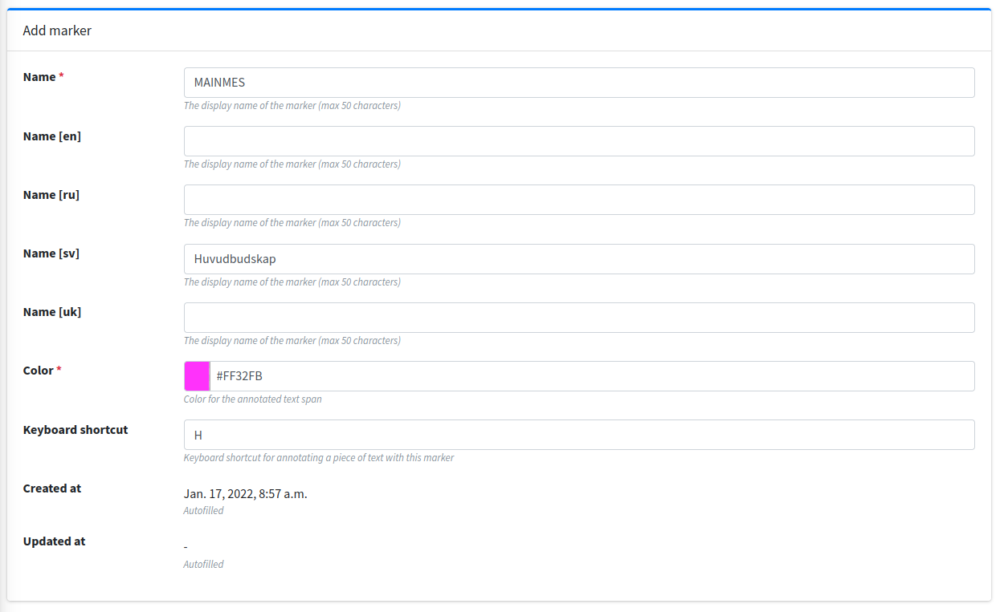

Markers & Labels
==================

If you want to annotate a task currently unsupported by Textinator or simply customize a new task, you will have to define custom units of annotation. Textinator supports such customized definitions through `Markers`. You need just a couple of things to define a basic `Marker`:

* find a descriptive name that will be displayed for the annotators;
* choose a color;
* choose a shortcut for the marker *(optional)*;
* choose a short nickname for the marker *(even more optional)*.

Let's say we want the annotators to find and mark the main message of the text, then filled-in `Marker` fields (corresponding to the properties listed above), would look like in the picture below.

