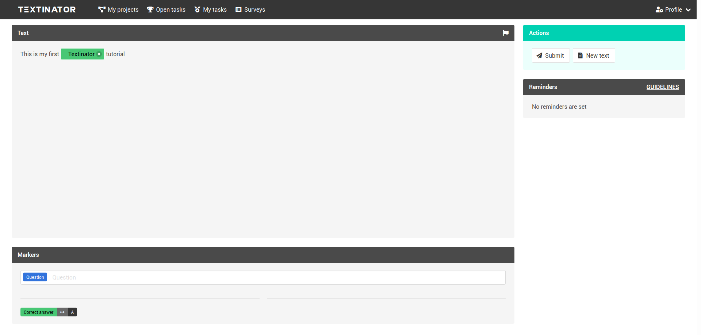
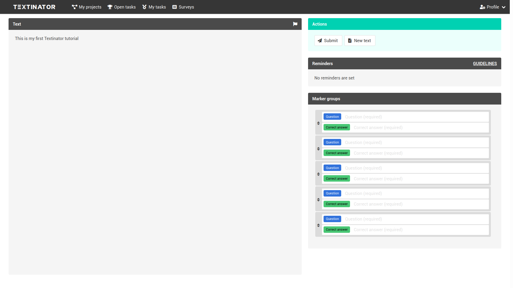
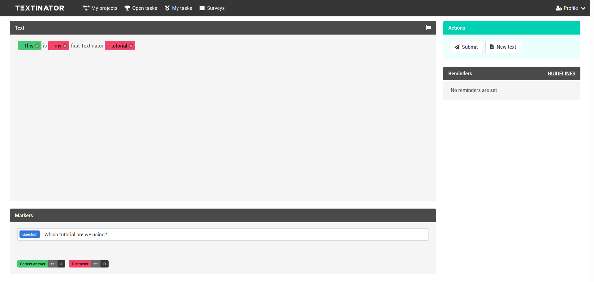
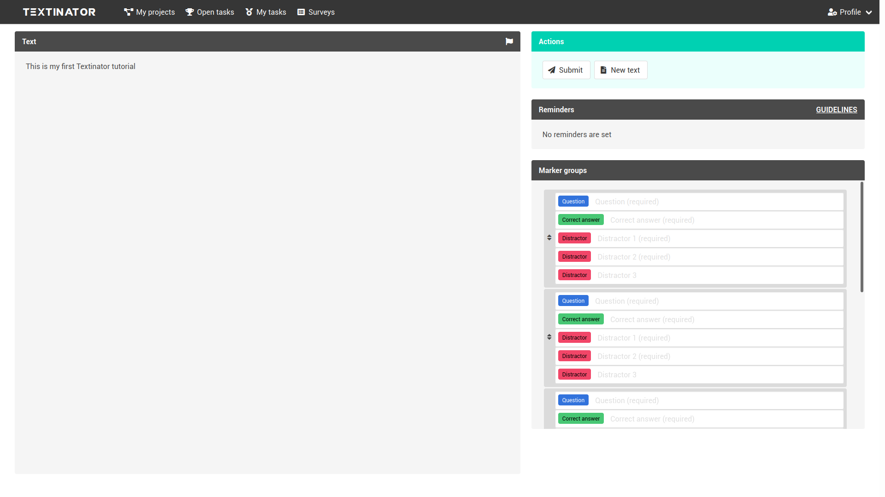
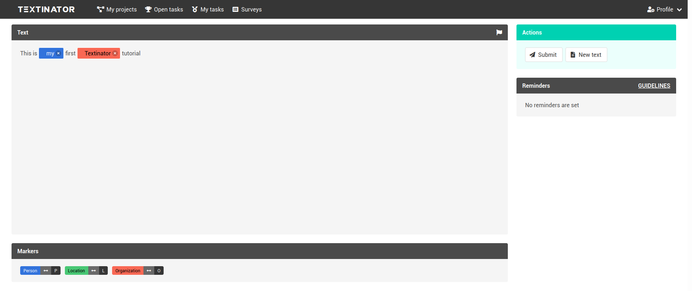
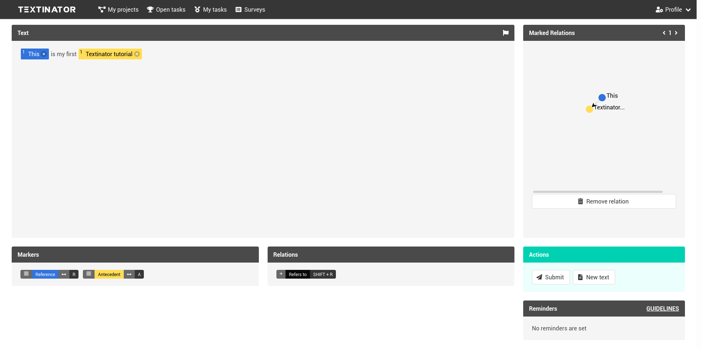
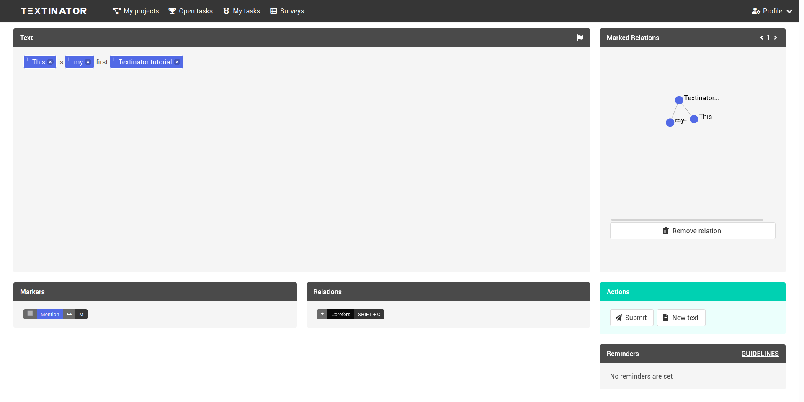
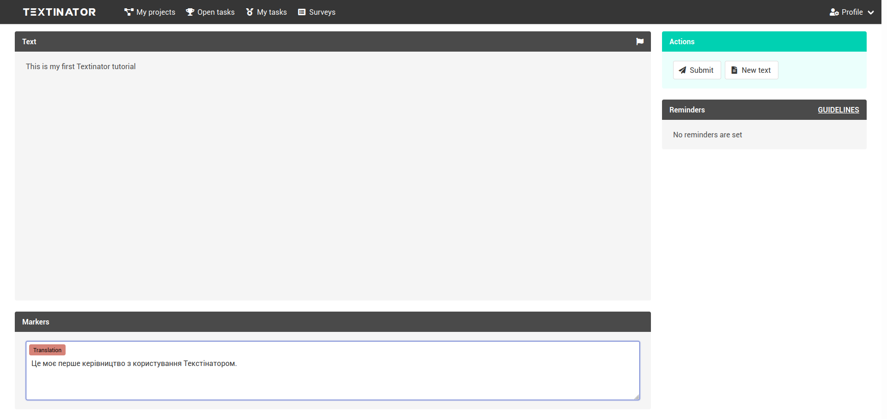

.. _standard tasks:

[Part 1] Exploring annotation tasks supported out-of-the-box
=============================================================
Currently Textinator supports 8 annotation tasks out-of-the-box. Note that although adding new markers to these default annotation tasks is possible, but data exporters might not support the added markers. Please consult the documentation for each annotation task separately on the :ref:`the page about custom tasks<custom_annotation_task>`. The information about how you can create a completely custom annotation task if you wish so, is available on the same page.

.. contents:: Table of Contents
	:local:

Question Answering
-------------------

Question Answering with Ranking
--------------------------------

Multiple Choice Question Answering
-----------------------------------

Multiple Choice Question Answering with Ranking
-------------------------------------------------

Named Entity Recognition
---------------------------

Pronoun Resolution
-------------------------------

Co-reference Chain Resolution
-------------------------------

Machine Translation
--------------------
